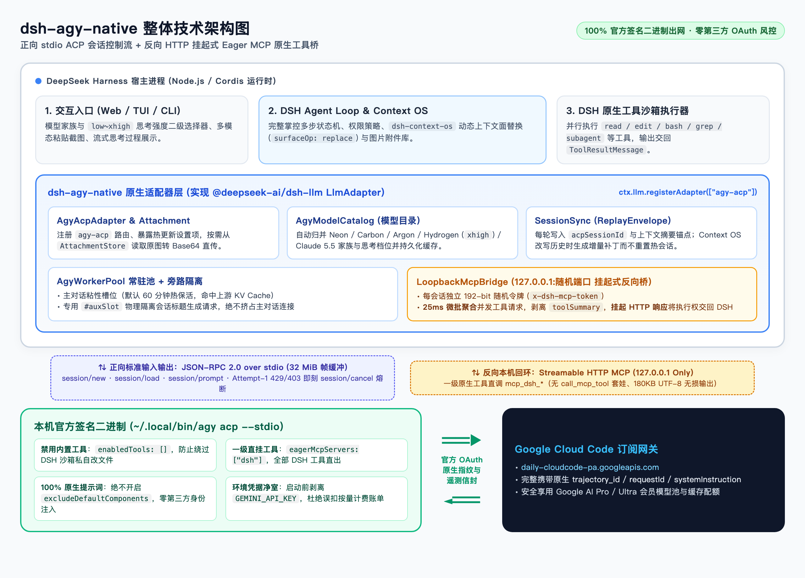
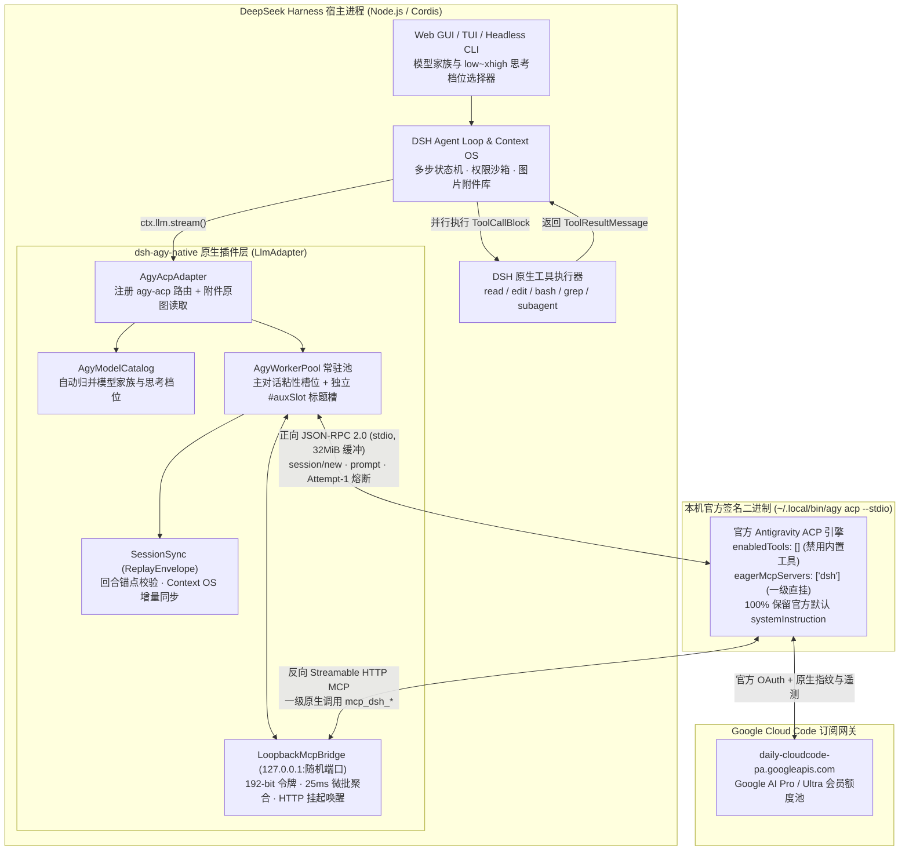
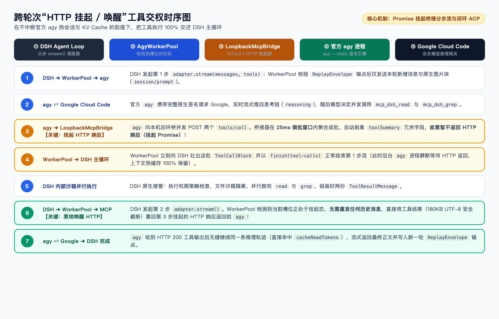
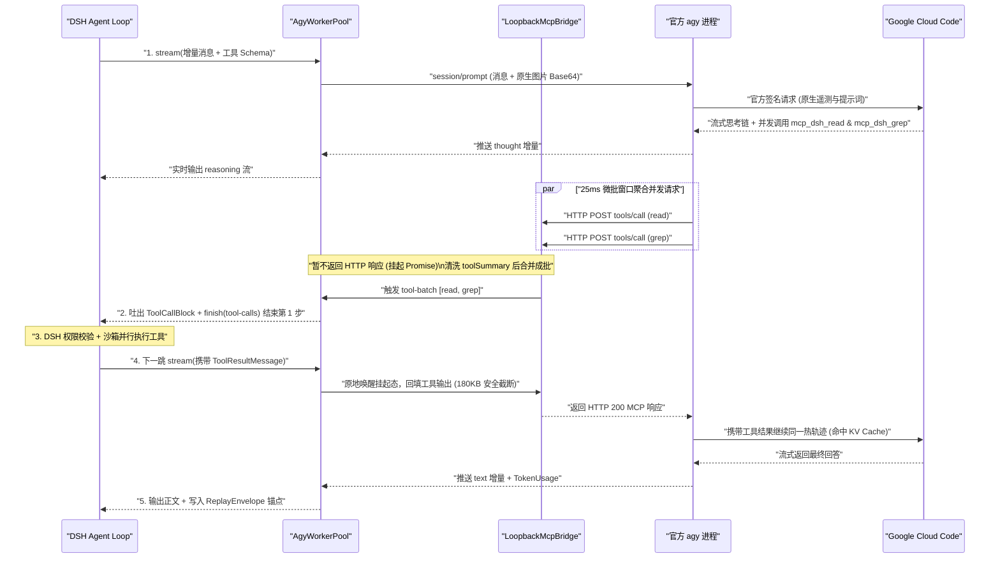

# dsh-agy-native 技术架构说明

> 可直接在右侧 **Better Sidebar** 预览本文档（含交互式 Mermaid 架构图与高清 PNG 图表）。

---

## 一、核心架构拓扑（Mermaid 视图）

```mermaid
flowchart TB
    subgraph DSH["DeepSeek Harness 宿主进程 (Node.js / Cordis)"]
        UI["Web GUI / TUI / Headless CLI\n模型家族与 low~xhigh 思考档位选择器"]
        Loop["DSH Agent Loop & Context OS\n多步状态机 · 权限沙箱 · 图片附件库"]
        Tools["DSH 原生工具执行器\nread / edit / bash / grep / subagent"]

        subgraph Plugin["dsh-agy-native 原生插件层 (LlmAdapter)"]
            Adapter["AgyAcpAdapter\n注册 agy-acp 路由 + 附件原图读取"]
            Catalog["AgyModelCatalog\n自动归并模型家族与思考档位"]
            Sync["SessionSync (ReplayEnvelope)\n回合锚点校验 · Context OS 增量同步"]
            Pool["AgyWorkerPool 常驻池\n主对话粘性槽位 + 独立 #auxSlot 标题槽"]
            MCP["LoopbackMcpBridge (127.0.0.1:随机端口)\n192-bit 令牌 · 25ms 微批聚合 · HTTP 挂起唤醒"]
        end

        UI --> Loop
        Loop -->|"ctx.llm.stream()"| Adapter
        Adapter --> Catalog
        Adapter --> Pool
        Pool --> Sync
        Pool <--> MCP
        Loop -->|"并行执行 ToolCallBlock"| Tools
        Tools -->|"返回 ToolResultMessage"| Loop
    end

    subgraph AGY["本机官方签名二进制 (~/.local/bin/agy acp --stdio)"]
        AgyCore["官方 Antigravity ACP 引擎\nenabledTools: [] (禁用内置工具)\neagerMcpServers: ['dsh'] (一级直挂)\n100% 保留官方默认 systemInstruction"]
    end

    subgraph Google["Google Cloud Code 订阅网关"]
        CloudCode["daily-cloudcode-pa.googleapis.com\nGoogle AI Pro / Ultra 会员额度池"]
    end

    Pool <-->|"正向 JSON-RPC 2.0 (stdio, 32MiB 缓冲)\nsession/new · prompt · Attempt-1 熔断"| AgyCore
    AgyCore <-->|"反向 Streamable HTTP MCP\n一级原生调用 mcp_dsh_*"| MCP
    AgyCore <-->|"官方 OAuth + 原生指纹与遥测"| CloudCode
```

---

## 二、跨轮次“HTTP 挂起 / 唤醒”工具交权时序

```mermaid
sequenceDiagram
    participant DSH as "DSH Agent Loop"
    participant Pool as "AgyWorkerPool"
    participant MCP as "LoopbackMcpBridge"
    participant AGY as "官方 agy 进程"
    participant G as "Google Cloud Code"

    DSH->>Pool: "1. stream(增量消息 + 工具 Schema)"
    Pool->>AGY: "session/prompt (消息 + 原生图片 Base64)"
    AGY->>G: "官方签名请求 (原生遥测与提示词)"
    G-->>AGY: "流式思考链 + 并发调用 mcp_dsh_read & mcp_dsh_grep"
    AGY-->>Pool: "推送 thought 增量"
    Pool-->>DSH: "实时输出 reasoning 流"

    par "25ms 微批窗口聚合并发请求"
        AGY->>MCP: "HTTP POST tools/call (read)"
        AGY->>MCP: "HTTP POST tools/call (grep)"
    end

    Note over MCP,Pool: "暂不返回 HTTP 响应 (挂起 Promise)\n清洗 toolSummary 后合并成批"
    MCP->>Pool: "触发 tool-batch [read, grep]"
    Pool-->>DSH: "2. 吐出 ToolCallBlock + finish(tool-calls) 结束第 1 步"

    Note over DSH: "3. DSH 权限校验 + 沙箱并行执行工具"

    DSH->>Pool: "4. 下一跳 stream(携带 ToolResultMessage)"
    Pool->>MCP: "原地唤醒挂起态，回填工具输出 (180KB 安全截断)"
    MCP-->>AGY: "返回 HTTP 200 MCP 响应"

    AGY->>G: "携带工具结果继续同一热轨迹 (命中 KV Cache)"
    G-->>AGY: "流式返回最终回答"
    AGY-->>Pool: "推送 text 增量 + TokenUsage"
    Pool-->>DSH: "5. 输出正文 + 写入 ReplayEnvelope 锚点"
```
